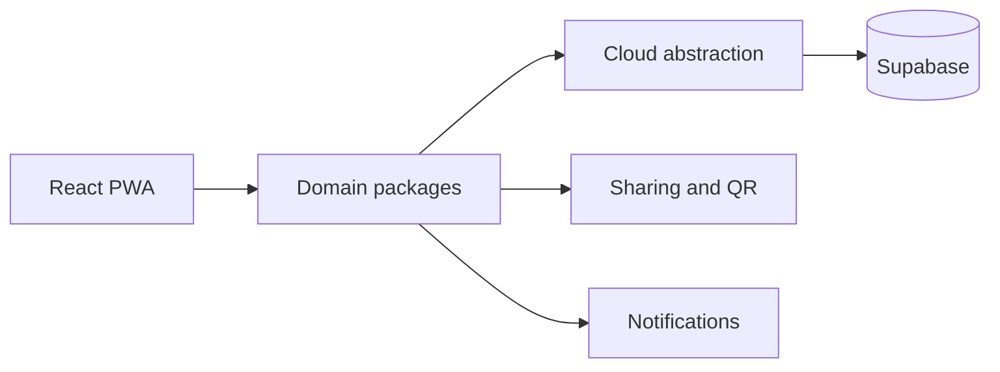

# Wishstar

A modular social wishlist and gifting platform developed with Claude Code.

> **Portfolio showcase:** the product source remains private. This repository documents the engineering work without exposing proprietary implementation details.

## Overview

Wishstar is a TypeScript platform for creating and sharing wishlists, discovering gift ideas and coordinating social gifting experiences. Its workspace architecture separates product domains so features can evolve independently.

## Capabilities

- Wishlist creation and management
- Profiles, settings and authentication flows
- Social sharing and QR-code support
- Marketplace and search foundations
- Notifications and update workflows
- Supabase-backed cloud services
- Progressive Web App support

## Technical design

The application uses React, TypeScript and Vite in a workspace-based monorepo. Domain packages include core, cloud, gifting, marketplace, notifications, profile, search, settings, sharing, social, updates and wishlist modules.

## Development with Claude Code

Claude Code assisted with modular design, implementation and refinement. Human review governed requirements, integration choices and acceptance of changes.

## Intellectual property

Copyright © 2026 Claudia Garau. All rights reserved. No permission is granted to reproduce or commercially exploit the private implementation or brand assets.

## Portfolio code samples

The `portfolio-review` branch contains focused TypeScript excerpts and tests for privacy rules, social visibility and idempotent gift reservations. Authentication, persistence and production integrations remain private.
